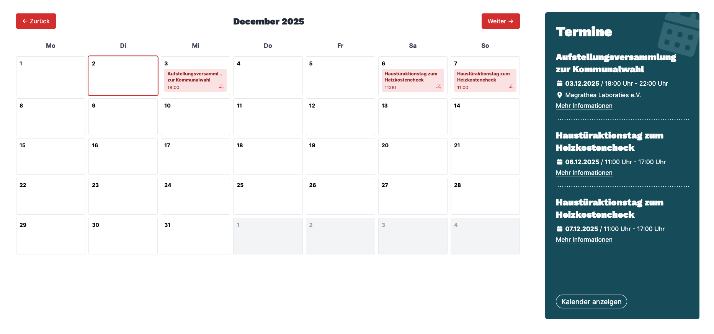
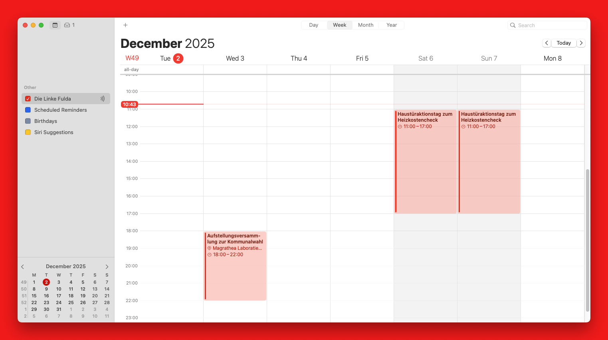

# Linke Calendar

Ein Dienst, der Zetkin Termine als Kalender oder Liste im Typo3 "DAS LINKE CMS" einbettet.

## Funktionen

- Abrufen aller Termine aus Zetkin für euren KV/LV
- Einbettung der Termine als Kalender oder Liste via `<iframe>` in die Website
- Stellt iCal-Link zur Verfügung, womit der Kalender in mobilen Kalender-Apps abonniert werden kann



Eine Live-Vorschau kann auf der Seite des [KV Fuldas](https://www.die-linke-fulda.de/termine/) eingesehen werden. Bei Rückfragen zur Integration [gerne kontaktieren](https://romanzipp.com).

## 1. Eure URL zusammenstellen

Damit die korrekten Daten für euren KV/LV angezeit werden, müsste ihr eure eigene URL zusammenstellen.

### Zetkin

Dafür musst ihr zuerst eure **Zetkin Organisations-ID** rausfinden.

1. In Zetkin einloggen und das [Dashboard](https://www.zetkin.die-linke.de/dashboard/organizations) aufrufen.
2. Den gewünschten KV/LV anklicken. (hier z.B. "KV Fulda")
3. Die aufgerufene Browser-Adresse hat folgendes Schema: `https://www.zetkin.die-linke.de/o/192/`
    - Hier endet die Adresse mit der Zahl `192` - also ist eure Zetkin Organisations-ID die `192`

### Die URL

Ersetzt nun den Platzhalter `<ORG>` mit der vorher ausgelesenen Organisations-ID. Die URLs braucht ihr gleich.

```
https://linke-calendar.romanzipp.com/org/<ORG>/calendar
https://linke-calendar.romanzipp.com/org/<ORG>/list
```

## 2. Einbetten in CMS

Die verfügbaren Komponenten (Kalender & Termin-Liste) werden per `iframe` eingebettet. Selbst werden sie auf einem anderen Server bereitgestellt und nur im CMS "referenziert".

### Kalender

Zum Einbetten des Kalenders muss ein neuer Seitinhalt "Reines HTML" eingefügt werden.


Diese Maske sollte nun zu sehen sein:


Die URL für den Kalender hat das folgende Format. Wie oben - ersetzt `<ORG>` mit eurer Organisations-ID.

```
https://linke-calendar.romanzipp.com/org/<ORG>/calendar
```

In das "HTML-Code" Feld wird nun der folgende Code eingefügt. Stelle sicher, dass die URL in `src="..."` die korrekt erstellte URL für euren KV/LV ist.

```html
<iframe id="calendar-embed"
        src="https://linke-calendar.romanzipp.com/org/<ORG>/calendar" 
        width="100%" 
        height="700" 
        scrolling="no"></iframe>

<style>
  #calendar-embed { 
    display: none; 
    margin-bottom: 2rem;
  }
  
  @media (min-width: 576px) {
    #calendar-embed { display: block; }
  }
</style>
```

---

### Termin-Liste

Zum Einfügen der Termin-Liste muss ein neuer Seitinhalt "Reines HTML" eingefügt werden.


Diese Maske sollte nun zu sehen sein:


Die URL für den Kalender hat das folgende Format. Wie oben - ersetzt `<ORG>` mit eurer Organisations-ID.

```
https://linke-calendar.romanzipp.com/org/<ORG>/list?color=white
```

Es können zusätzliche URL Query-Parameter angehangen werden:

- `color`: Farbe des Texts (verfügbar: `black`, `white`)

In das "HTML-Code" Feld wird nun der folgende Code eingefügt. Stelle sicher, dass die URL in `src="..."` die korrekt erstellte URL für euren KV/LV ist.

```html
<header class="card-header">
  <div class="card-title">
    <h1 itemprop="headline">
      Termine
    </h1>
  </div>
</header>

<iframe src="https://linke-calendar.romanzipp.com/org/<ORG>/list?color=white"
        width="100%" 
        height="630"></iframe>

<div>
  <a href="/termine/" class="btn btn-primary mt-2">
    Kalender anzeigen
  </a>
</div>
```

## 3. iCal-Endpunkt

Der Dienst erlaubt es euch auch, einen Link herauszugeben, welcher in allen gänigen Kalender-Apps (Google, Apple Kalender, Thunderbird, etc.) "abonniert" werden kann.
Damit landen alle Zetkin Termine automatisch im Kalender eurer Smartphones oder Computer.

Hier - wie zuvor aus - das `<ORG>` gegen eure Organisations-ID austauschen. Der Link kann dann auf eurer Website ausgegeben werden.

```
https://linke-calendar.romanzipp.com/org/<ORG>/ical
```

- [Anleitung für Apple iPhone](https://support.apple.com/de-de/102301)
- [Anleitung für Google Kalender](https://support.google.com/calendar/answer/37100?hl=de&co=GENIE.Platform%3DDesktop) ("Öffentlichen Kalender über einen Link hinzufügen")
- [Anleitung für Thunderbird](https://ffw-saltendorf-boesenbechhofen.de/termine/kalender-abonnieren/thunderbird/)



## Self-Hosted

Der Server kann selbstverständlich auch selbst betrieben werden. Ein [fertiges Docker Image](https://github.com/romanzipp/Linke-Calendar/pkgs/container/linke-calendar) wird über GitHub bereitgestellt.

Im Repo liegt eine [docker-compose.yml](docker-compose.yml) Beispieldatei bei.

## API Endpoints

- `GET /health` - Health check endpoint
- `GET /org/{org}/calendar` - Calendar view for a specific organization
  - Query params: `year`, `month` (optional)
- `GET /org/{org}/list` - List view showing all upcoming events in chronological order
  - Query params: `color` (optional)
- `GET /org/{org}/ical` - iCal endpoint for subscribing with mobile device
  - Organization name is automatically fetched from Zetkin API and used as calendar title
- `GET /event/{eventID}` - Event detail modal
- `GET /static/*` - Static files (CSS, JS, fonts)

## Configuration

Create a `config.yaml` file:

```yaml
scraper:
  interval: "6h"
  timeout: "30s"

server:
  port: "8080"
  host: "0.0.0.0"
```

Organizations are automatically discovered when first accessed via the URL. The scraper will then periodically update events for all organizations that have been accessed.

## License

MIT
